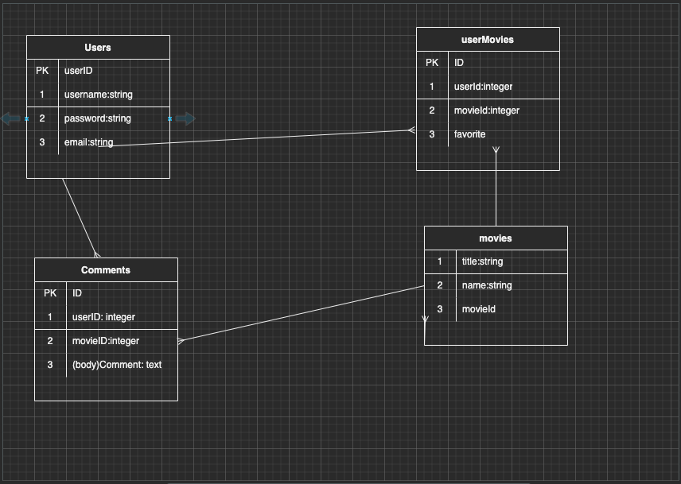
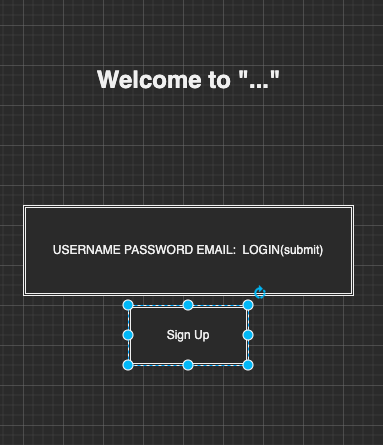
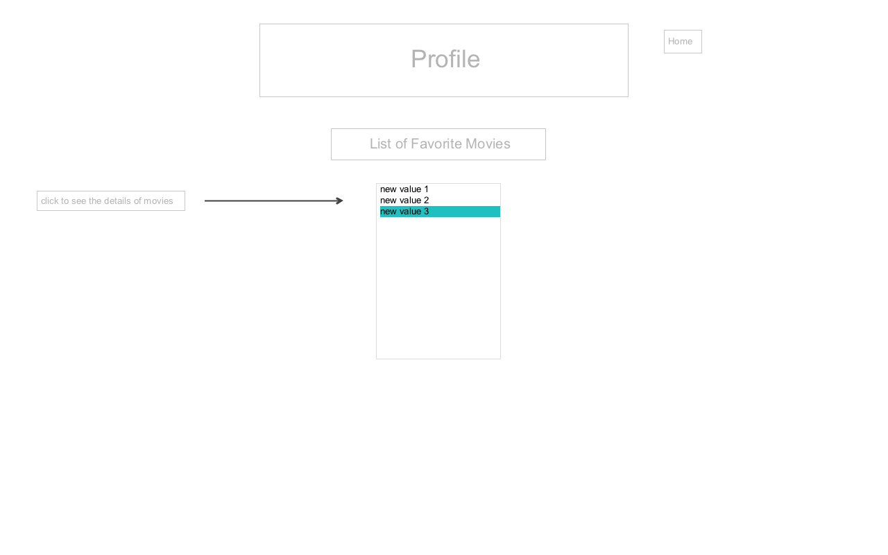
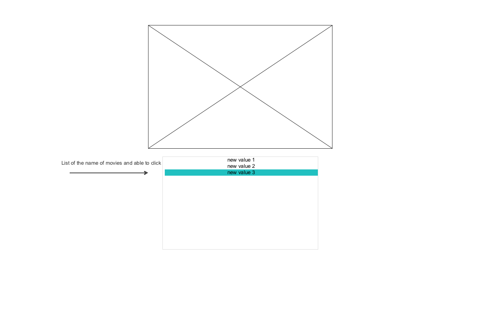
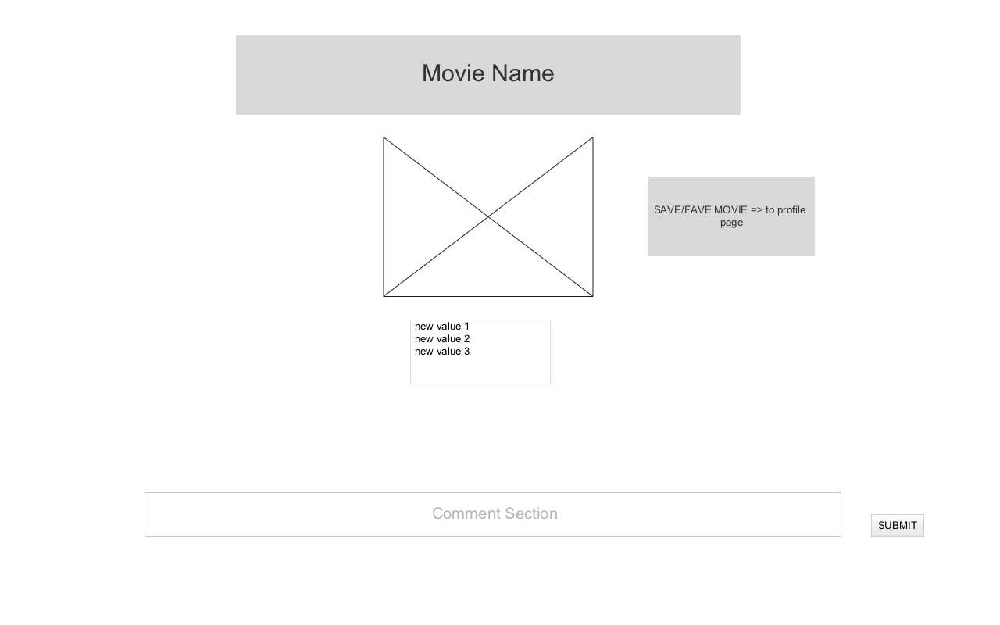
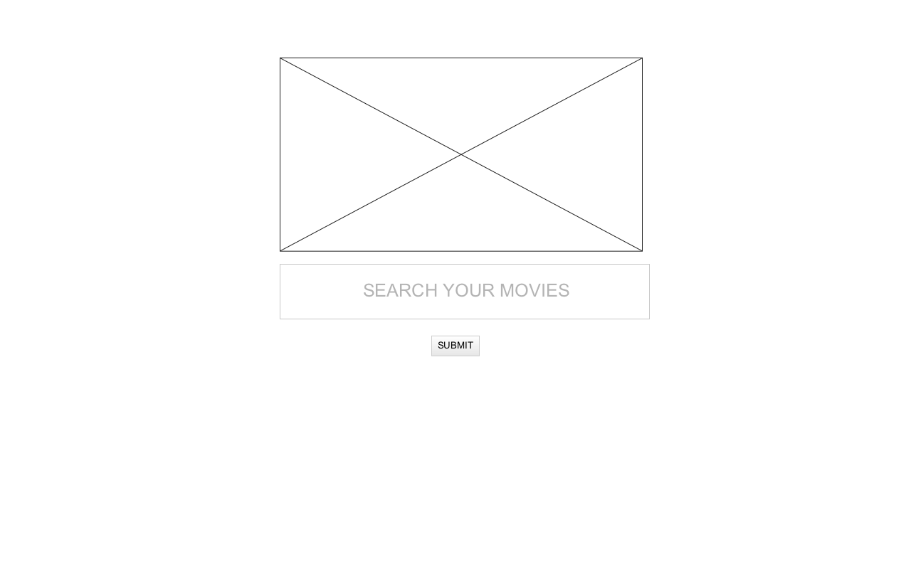

## Favorite Anime
* You want to search up the anime and leave a comment on the page so other people can review it? Use this website where you can search up animes, and see what other people have commented about it!

## Deployment Link
https://anisearchz.herokuapp.com/

## Installation Instructions
* Fork and Clone this repository
* npm i to install dependencies 
* Need a env file to store your ENC_KEY
* Nodemon to run the application(localhost:3000)
* This application uses jikan API but does not need an API key
* echo node_modules >> .gitignore

## ERD

## API
* https://api.jikan.moe/v4/anime?q=boruto

| VERB | URL pattern | Action \(CRUD\) | Description |
| :--- | :--- | :--- | :--- |
| GET | / | Index | login site |
| GET | /users/signup | Where you create an account | 
| POST | /users/signup |  after you sign up it redirects to profile page |
| GET | /users/login | A page where you log in |
| POST| /users/login | After you login it will redirect you to profile page|
| GET | /users/logout| A page where you log out |
| GET | /users/profile | A page where it's your own personal profile |
| POST | /users/profile | Creates the profile page | 
| GET | /anime  | list of the movies |
| GET | /anime/:id  | Details page of the anime you have searched |
| GET | /anime/edit/:id  | Page where you can edit your comment |
| PUT | /anime/edit | Updates your comment |
| DELETE | /profile | Deletes the anime that you have saved |
| DELETE | /anime/:id | Deletes the comment you have saved |

## User Views

## User Stories
* As a user, I would want to be able to log in and be directed to the home page where I can search up the animes
* As a user, I would want to be able to comment on the animes that I am searching up so other people who are searching the same animes, can see my comments
* As a user, I would want to have a profile page and within that page, I would want to see the anime that I have saved

## MVP 
* Created a login page area and a signup area and log out
* Create a profile page
* Create a search engine where people can search their anime
* Create a page of the anime, and their details and a comment section on that anime page where people can leave their comments about the anime
* A favorite/save option where it would saved on to their profile page

## Stretch
* Create a section where people can like/comment on their profile page
* Create where people can follow other people's profile
* A way to like a anime or downvote the anime.